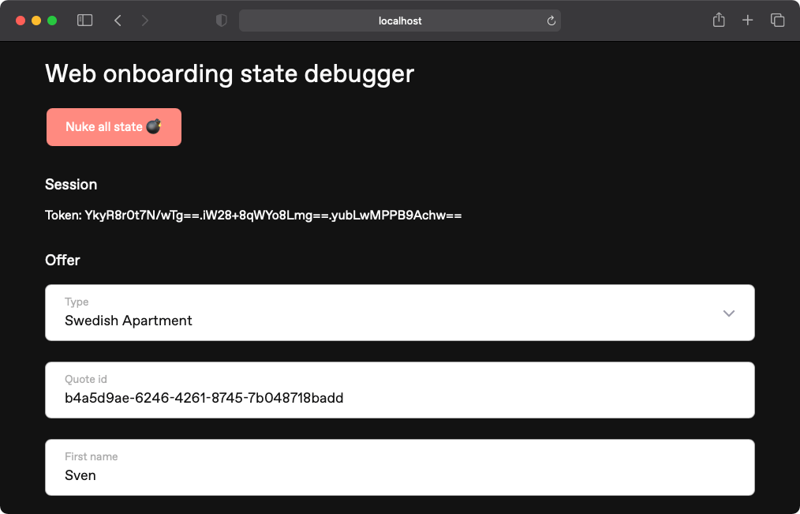

# Hedvig Web Onboarding

This is the web based onboarding that you can find at [https://www.hedvig.com/se-en/new-member](https://www.hedvig.com/se-en/new-member).

## Prerequisites

- `node`
- `yarn`

### Install Node with nvm

1. Install `nvm` [https://github.com/creationix/nvm](https://github.com/creationix/nvm)
2. `nvm install` (installs the node version specified in `.nvmrc`)
3. `nvm use` (use version from `.nvmrc`)

### Install Yarn package manager

Use one of the following `yarn` or `yvm`

#### Install Yarn

1. Install `yarn` [https://classic.yarnpkg.com/en/docs/install/#mac-stable](https://classic.yarnpkg.com/en/docs/install/#mac-stable)

#### Install yvm

`yvm` is a neat yarn version manager just like `nvm` is for node.

1. Install `yvm` [https://yvm.js.org/docs/overview#installation](https://yvm.js.org/docs/overview#installation)
2. Run any yarn command and watch it automagically use the correct version of yarn. (Version specified in `package.json` or `.yvmrc`)

## Installation

```sh
# Install dependencies
$ yarn
```

## Storybook

```sh
# Start Storybook
$ yarn storybook
```

## Development

```sh
# Compile the source files (only needed the first time)
$ yarn build

# Start the app
$ yarn watch
```

The app is running on `http://localhost:8040`. Visit [http://localhost:8040/se/new-member/](http://localhost:8040/se/new-member/) to view the first screen of the onboarding flow.

### Debugger UI

Manually stepping through the onboarding flow becomes tedious. Therefore, you can use the "debugger UI" that let's you bypass the initial steps and takes you straight to the "Offer page".

You access it locally on this URL: `http://localhost:8040/se/new-member/debugger`.
It also works in staging: `https://www.dev.hedvigit.com/se/new-member/debugger`.



> You might experience problems due to existing state interfering with the session. Click the "Nuke all state 💣" button to perform a reset and try again.

1. Fill in offer information.
1. Click the "Create quote" button.
1. You should see a bunch of GraphQL data and a button to take you to the "Offer page".

Or, if you have an id of an existing quote you'd like to use it's possible to replace the quote id generated for this session - the existing quote will be fetched as soon as you add the id to the input field.

## Analytics

We use Segment, Mixpanel and Google Tag Manager as our analytics tools. You can read about the setup in [Notion](https://www.notion.so/hedviginsurance/Mixpanel-Setup-iOS-Web-Embark-d1abeb9ba7634adea6155f847d32cd8d)

## Text keys

Text keys live in [Lokalise](https://lokalise.com/) and are exported from there with the script `yarn download-translations`.

This is the process for updating/adding text keys:

1. Make updates to text keys in Lokalise, i.e. add new text keys or update translations. Preferably we use the Figma/Sketch
   plugin to export text keys and translations directly from design.
2. Download updates from Lokalise by using `yarn download-translations`
   1. Ensure you have installed the [Lokalise CLI tool](https://github.com/lokalise/lokalise-cli-2-go)
   2. Generate an API token with "Read-only access" in your [Lokalise profile page](https://app.lokalise.com/profile)
   3. Run `yarn download-translations` and follow the instructions
   4. All text keys tagged with "web-onboarding" will be exported to the translation JSON files. 🤑

### Debugging

To know which text key is used where you can suffix the url anywhere with `?debug=textkeys` to show text keys instead of translations, and to disable
the debug mode you can suffix the url with `?debug=none`.

## Updating GraphQL queries and mutations

Most GraphQL requests are defined in `*.graphql` files under `/src/client/graphql`. These are the input to the code generation step that produces `/src/client/data/graphql.tsx`. To update a query or mutation defined in such a file:

1. Access the relevant `*.graphql` file and update the query/mutation
1. Run `yarn codegen`
1. Try and commit the new changes to both the `*.graphql` file as well as the autogenerated `graphql.tsx` file.

> If you want to define a reusable GraphQL fragment, place a `*Fragment.graphql` file in the same folder as the rest of the queries and mutations. You can simply references it inside another `*.graphql` file using the fragment name.
